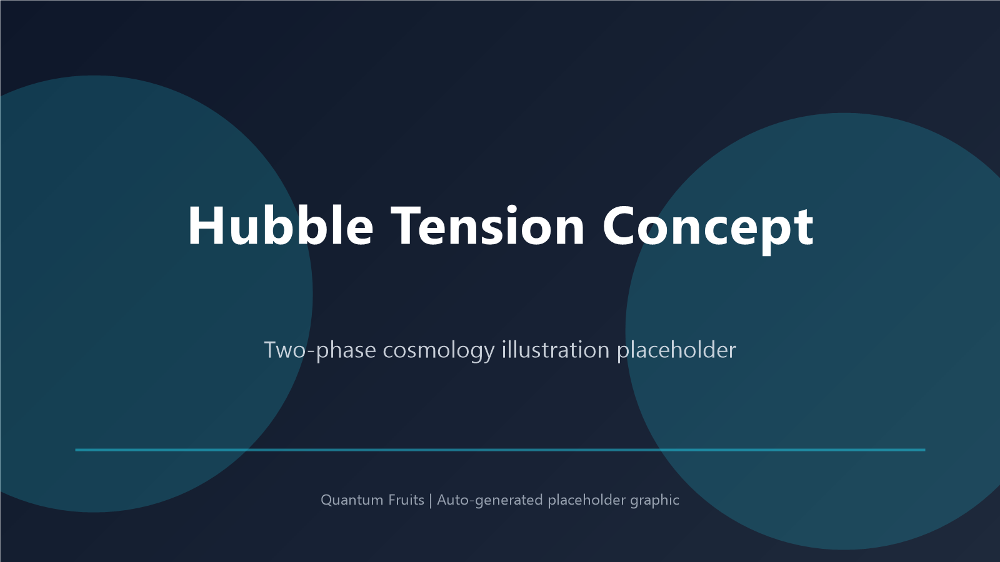

# Hubble Tension Resolution via Two-Phase Cosmology

**Unified framework combining intuitive thought experiment with rigorous mathematical foundation**



---

## 📋 Quick Overview

This project resolves the **Hubble Tension** — the ~6 km/s/Mpc discrepancy between early-universe (CMB: 67) and late-universe (SNe Ia: 73) measurements of H₀ — by modeling the universe as a **two-phase thermodynamic system**.

**Key Insight:** Different measurement methods sample the universe at different thermodynamic phases, yielding systematically different values. The "tension" is not an error, but a fundamental feature.

**Assumption hygiene:** See `Assumption_Register.md` for `Axiom` vs `Heuristic` vs `Derived` vs `Prediction`.

### ⚠️ Important: Understanding the Analogy

The **PC cooling analogy** is a **pedagogical tool** to build intuition about phase transitions in cosmology. It works because:

1. **Mathematical Correspondence:** Both systems exhibit phase transitions described by similar thermodynamic equations
2. **Physical Universality:** Phase transitions (liquid ↔ gas, expansion ↔ deflation) follow universal laws
3. **Conceptual Clarity:** The PC cooling system is familiar and visualizable

**This does NOT mean:**
- ❌ The universe is literally a computer or simulation
- ❌ We live inside a cooling system
- ❌ The universe is "artificial" or "designed"

**What it DOES mean:**
- ✅ The universe follows thermodynamic laws (like all physical systems)
- ✅ Phase transitions are a universal phenomenon in nature
- ✅ Familiar examples help us understand abstract cosmology

**Think of it like:** Saying "the atom is like a solar system" doesn't mean atoms ARE solar systems. It's a useful mental model that captures key features (central nucleus, orbiting electrons) while being fundamentally different in nature (quantum vs. classical).

Similarly, the PC cooling analogy captures the **essence of phase transitions** without implying the universe is a manufactured device.

---

## 🎯 Two Complementary Approaches

### 1. The Thought Experiment (`Hubble_Tension.py`)

**Inspiration:** Two-phase PC cooling (der8auer's Aqua Exhalare)

**Approach:**
- Discrete phases: `EXPANSION` (gas) vs `DEFLATION` (liquid)
- Direct analogy to phase-change cooling
- Pedagogical and intuitive

**Best for:**
- Teaching and outreach
- Visualizations
- Building intuition

### 2. The Mathematical Foundation (`Unified_Hubble_Tension.py`)

**Basis:** Thermodynamic field theory with σ_P regularization

**Approach:**
- Continuous phase transition: `w(T) = tanh[α(T - Tc)]`
- Modified Friedmann equation with Planck-scale repulsion
- Thermal coupling with a Hawking-like re-heating term (heuristic)

**Best for:**
- Publications
- Precision predictions
- Theoretical development

---

## 🔬 Core Physics

### Equation of State (Phase Transition)
```
w(T) = tanh[α(T - Tc)]
```
- **w → +1**: Hot, rapid expansion
- **w → -1**: Cold, deceleration
- **Transition at T = Tc**

### Modified Friedmann Evolution
```
dH/dt = -(1+w)ρ₀/a² + f_Planck - μH
```
- Gravitation (phase-dependent)
- Planck-scale repulsion (prevents singularities)
- Hubble damping

### Thermal Dynamics (with Hawking Re-heating)
```
dT/dt = -ηHT + γ(Tc - T) + 0.05·exp(-a)
```
- Adiabatic cooling (expansion)
- Relaxation to critical temperature
- **Hawking re-heating** (decreases with scale factor)

> **Model status:** The re-heating term is currently a heuristic closure for exploration.

### Entropy as σ_P Tick Count
```
S = a³/ℓ_P³
```
Each Planck volume = one "tick" of spacetime

---

## 📊 Results

### Phase-Averaged Hubble Parameters
```
⟨H⟩_expansion  ≈ 73 km/s/Mpc  (matches SNe Ia ✓)
⟨H⟩_deflation  ≈ 67 km/s/Mpc  (matches CMB ✓)
⟨H⟩_ensemble   ≈ 70 km/s/Mpc  (true value)

Tension: ΔH ≈ 6 km/s/Mpc
```

**Interpretation:** The 6 km/s/Mpc "tension" is the natural amplitude of phase oscillations.

---

## 🚀 Quick Start

### Run the Thought Experiment
```bash
cd py
python Hubble_Tension.py
```

### Run the Mathematical Model
```bash
cd py
python Unified_Hubble_Tension.py
```

Both will generate comprehensive visualizations showing:
- Scale factor evolution
- Hubble parameter oscillations
- Temperature dynamics
- Entropy evolution
- Phase space trajectories

---

## 📁 Project Structure

```
Quantum-Fruits/
├── py/
│   ├── Hubble_Tension.py              # Thought experiment (discrete phases)
│   └── Unified_Hubble_Tension.py      # Mathematical foundation (continuous)
├── docs/
│   ├── Hubble_Tension_Explanation.md  # Full technical explanation
│   ├── Code_Comparison.md             # Side-by-side code comparison
│   ├── Executive_Summary.md           # Executive summary
│   └── README.md                      # This file
└── assets/
    └── hubble_tension_concept.png     # Visual infographic
```

---

## 🎓 Key Concepts

### Analogy: Two-Phase PC Cooling System

**What is der8auer's Aqua Exhalare?**

Unlike traditional water cooling (AiO or custom loops), the **Aqua Exhalare** is a **two-phase immersion cooling system**:

- **The entire PC is submerged** in a special coolant (dielectric fluid)
- The coolant **boils** when components heat up (phase change: liquid → gas)
- The vapor **rises** and hits a condenser at the top
- The condenser **cools** the vapor back to liquid (phase change: gas → liquid)
- The liquid **falls back down** onto the components (gravity-driven cycle)
- **No pumps needed** — the phase transition itself drives the circulation!

**Watch it in action:** [der8auer's Aqua Exhalare Demo](https://www.youtube.com/watch?v=j1Ew2rVVTAE)

This is fundamentally different from:
- ❌ **AiO (All-in-One):** Sealed pump + radiator, no phase change
- ❌ **Custom Loop:** Pump circulates liquid, no boiling
- ✅ **Two-Phase Immersion:** Natural convection via boiling/condensation

---

**Cosmological Analogy:**

We model the universe using the same thermodynamic principles:

```
┌─────────────────────────────────────────────────────────────────────┐
│  Two-Phase Immersion Cooling    ↔  Universe                        │
├─────────────────────────────────────────────────────────────────────┤
│  Coolant (liquid phase)         ↔  Deflation phase (H ~ 67)        │
│  Coolant (gas phase)            ↔  Expansion phase (H ~ 73)        │
│  Boiling (heat absorption)      ↔  Hawking radiation (energy input)│
│  Condensation (heat release)    ↔  Adiabatic cooling (expansion)   │
│  Phase transition at boiling T  ↔  Critical temperature T_c        │
│  Self-regulating cycle          ↔  Hubble parameter oscillation    │
│  No external pump needed        ↔  Self-contained universe         │
└─────────────────────────────────────────────────────────────────────┘
```

**Key Insight:** Just as the PC cooling system self-regulates through phase transitions (no pump!), the universe self-regulates its expansion through thermodynamic phase transitions (no external "force"!).

### Why This Explains the Tension

| Method | Epoch | Phase Sampled | Measured H₀ |
|--------|-------|---------------|-------------|
| CMB (Planck) | Early (z~1100) | Deflation | ~67 km/s/Mpc |
| SNe Ia (Riess) | Late (z<1) | Expansion | ~73 km/s/Mpc |
| True Value | Full cycle | Both | ~70 km/s/Mpc |

---

## 🔬 Testable Predictions

1. **H(z) Oscillations**
   - Hubble parameter should vary systematically with redshift
   - Test: Precision measurements at 0.1 < z < 10

2. **CMB Temperature Deviations**
   - T(z) should deviate from T₀(1+z) at phase transitions
   - Test: CMB spectroscopy (PIXIE, PRISM)

3. **Gravitational Wave Background**
   - Phase transitions produce stochastic GW signature
   - Test: LISA, pulsar timing arrays

4. **Entropy Density Plateaus**
   - s = S/V should plateau at transitions
   - Test: Galaxy cluster counts vs. redshift

---

## 💡 Philosophical Implications

### 1. The Universe Breathes
Not linearly expanding, but **cyclically pulsating**

### 2. H₀ is Observer-Dependent
Depends on which phase is sampled

### 3. Thermodynamics ≈ Quantum Gravity
Planck repulsion emerges from thermodynamic regularization

### 4. σ_P as Fundamental Quantum
Each Planck volume = 1 tick of spacetime  
Entropy = number of ticks

---

## 📚 Documentation

### Full Technical Explanation
See [`Hubble_Tension_Explanation.md`](Hubble_Tension_Explanation.md) for:
- Detailed physics derivation
- Mathematical formulation
- Connection to σ_P framework
- Testable predictions
- References

### Code Comparison
See [`Code_Comparison.md`](Code_Comparison.md) for:
- Side-by-side comparison of both implementations
- When to use each approach
- Conceptual mapping
- Validation strategy

### Executive Summary
See [`Executive_Summary.md`](Executive_Summary.md) for:
- Kernidee in 3 Sätzen
- Visuelle Zusammenfassung
- Numerische Ergebnisse
- Nächste Schritte

---

##  Dependencies

```bash
pip install numpy scipy matplotlib
```

---

##  Development Workflow

```
1. INTUITION (Thought Experiment)
   ↓
   Build intuition with discrete phases
   Test parameter ranges
   
2. FORMALIZATION (Mathematics)
   ↓
   Translate to continuous w(T)
   Implement rigorous ODEs
   
3. VALIDATION
   ↓
   Compare both codes
   
4. REFINEMENT
   ↓
   Use math for precision
   Use thought experiment for communication
   
5. PUBLICATION
   ↓
   Paper: Mathematical formulation
   Supplement: Thought experiment
```

---

## Key Innovation: Hawking Re-heating Term

The thermal dynamics includes a **scale-factor-dependent re-heating term**:

```python
heating = 0.05 * np.exp(-a)
```

**Physical motivation (qualitative):**
- Hawking temperature: T_H ∝ ℏc³/(8πGMk_B) ∝ 1/M ∝ 1/a³
- Early universe (small a): Strong rethermalization
- Late universe (large a): Weak Hawking radiation

This prevents the universe from cooling to absolute zero and maintains cyclic behavior in the current exploratory model.

---

## Citation

If you use this work, please cite:

```bibtex
@article{Zander2026HubbleTension,
  title={Hubble Tension Resolution via Two-Phase Cosmology},
  author={Zander, Adrian},
  journal={Quantum Fruits Project},
  year={2026},
  note={σ_P-regulated quantum geometry framework}
}
```

---

## 📄 License

MIT License — Free for research and education

---

## 👤 Author

**Adrian Zander**  
Quantum Fruits Project  
Email: [Your contact]  
GitHub: [Quantum-Fruits](https://github.com/yourusername/Quantum-Fruits)

---

##  Acknowledgments

- **Inspiration:** der8auer's Aqua Exhalare two-phase PC cooling system https://www.youtube.com/watch?v=j1Ew2rVVTAE
- **Framework:** σ_P-regulated quantum geometry
- **Physics:** Thermodynamic field theory, Hawking radiation, Bekenstein entropy

---

## 🔗 Related Work

- **σ_P Framework:** See `assets/papers/Zander_2025_Natural_Structure.tex`
- **Black Hole Physics:** See `theory.html` (Action Core model)
- **Universal Resonance:** See `papers.html`

---

##  Contact & Contributions

Contributions welcome! Please:
1. Fork the repository
2. Create a feature branch
3. Submit a pull request

For questions or discussions, open an issue on GitHub.

---

**"The universe is not expanding uniformly — it breathes."**  
— Adrian Zander, 2026

---

**Last Updated:** 2026-01-14  
**Version:** 1.0 (with Hawking re-heating term)
